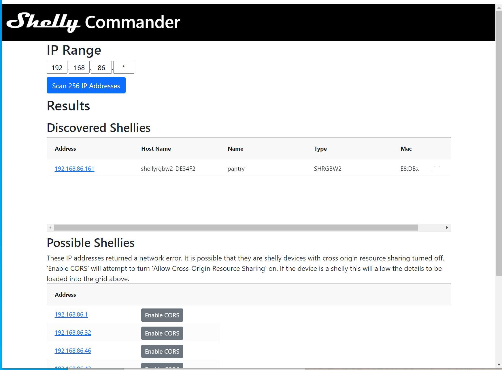
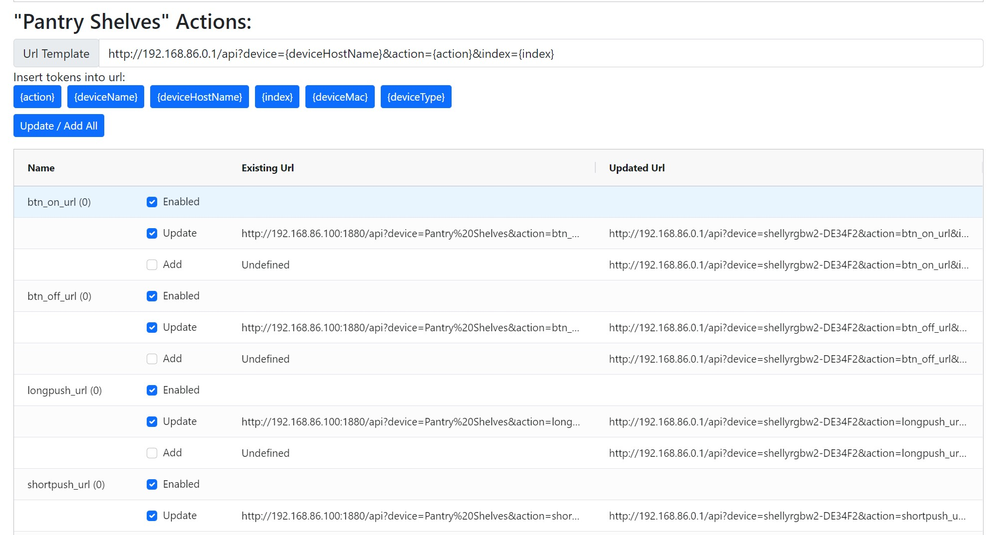

# Shelly Commander



A tool that scans a range of IPs looking for shelly devices allowing you to more easily manage them.

## How It Works

It makes a request to [`/shelly`](https://shelly-api-docs.shelly.cloud/gen1/#shelly) endpoint on every IP address and if a request is received adds it to the list of shellies displaying ip address, host name, name, type and mac address.

If an error is received the address is added to the `possible shellies` list. If the shelly devices does not have `cross origin resource sharing` switched on then it will appear in this list. the `Enable CORS` button can be used to attempt to switch this on so that you can see manage your shelly device.

## Action Urls



Shelly Commander makes it easy to update all (or a subset) of the action urls for your device. You update a template url, select the actions you want to enable and update and hit the update button and they are all updated on the device.

Given the template url:

`http://192.168.86.0.1/api?device={deviceHostName}&action={action}&index={index}`

each action url would look like this:

`http://192.168.86.0.1/api?device=shellyrgbw2-DE1234&action=btn_on_url&index=0`

The following values are supported in the url template:

 * **{action}**
 * **{deviceName}**
 * **{deviceHostName}**
 * **{index}**
 * **{deviceMac}**
 * **{deviceType}**

 ## Docker

 Host by deploying a docker container:

 ```bash
 $ docker run -p 80:80 roaders/shelly-commander:latest
 ```